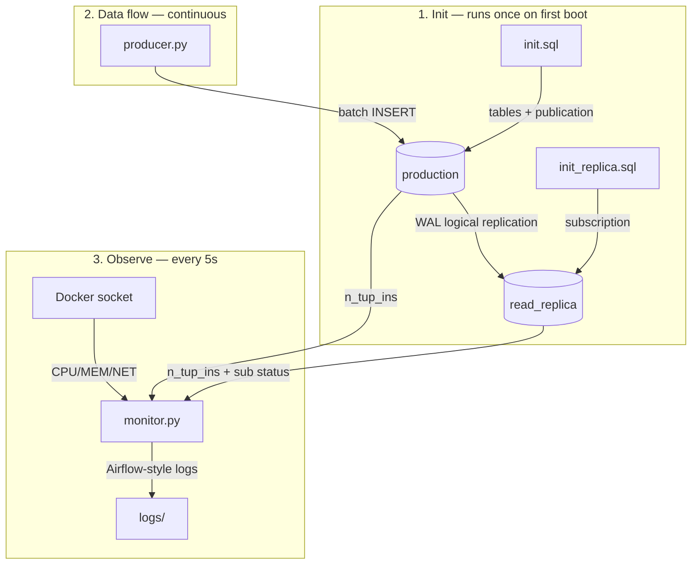

# CDC Pipeline — PostgreSQL Logical Replication Demo

A lightweight Change Data Capture (CDC) pipeline using **PostgreSQL native logical replication** — no Kafka, no Debezium, no extra tools. One producer pushes synthetic user activity logs into a **production** database, and a **read replica** receives every row in near real-time via the WAL stream.

**Performance**: 2.5 ~ 3 second lags for 20k rows per sec, on 2 ~20million rows table. For specific number please scroll dơn to the monitoring section.

## How it works



### 1. Init — database first boot

`init.sql` (production) creates `user_log_mobile` and `user_log_desktop` tables, then publishes both via `CREATE PUBLICATION cdc_pub FOR TABLE :tables;` — the table list is a single config variable.

`init_replica.sql` (replica) runs `CREATE SUBSCRIPTION cdc_sub ... PUBLICATION cdc_pub;` — the subscription's initial snapshot copies schema + existing rows (full-load first), then CDC streaming begins.

### 2. Data flow — producer → production → replica

`producer.py` generates random user activity rows (uid, activity, device, screen) and batch-inserts them into production. Speed is set in `producer_app/config.json`:

```json
{"BATCH": 500, "FREQ": 2}    → ~1,000 rows/s
{"BATCH": 5000, "FREQ": 2}   → ~10,000 rows/s
```

Every INSERT writes a WAL record. PostgreSQL's logical decoding streams changes from `cdc_pub` (production) to `cdc_sub` (replica) in near real-time — no Kafka, no Debezium, just Postgres.

### 3. Monitor — observe everything

`monitor.py` queries both databases and the Docker socket every 5 seconds, writing Airflow-style logs to `monitoring_app/logs/`:

| Source | Captures |
|---|---|
| `pg_stat_user_tables` (production) | Insert totals per table (live counter) |
| `pg_stat_user_tables` (replica) | Inserts received — diff from production = replication lag |
| `pg_stat_subscription` (replica) | CDC slot active? Last message time? |
| Docker stats API | CPU%, memory, network I/O rates per container |

## Project structure

```
CDC/
├── docker-compose.yml          # 4 services: production, read_replica, producer, monitor
├── init.sql                    # Creates tables + publication (runs on production first boot)
├── init_replica.sql            # Creates subscription (runs on replica first boot)
├── producer_app/
│   ├── Dockerfile
│   ├── producer.py             # Generates & inserts synthetic user_log rows
│   ├── config.json             # BATCH size & FREQ (rows/s target)
│   └── requirements.txt
├── monitoring_app/
│   ├── Dockerfile
│   ├── monitor.py              # Live dashboard + log writer
│   ├── config.json             # DB hosts, refresh & log rotate intervals
│   ├── requirements.txt
│   └── logs/                   # Mounted — log files appear here on host
├── config/                     # Custom postgresql.conf + pg_hba.conf per DB
└── data/                       # Mounted PGDATA — base/, pg_log/ visible on host
```

## Quick start

```bash
docker compose up -d --build
docker compose logs -f monitor   # watch the live dashboard
```

## Monitoring deep-dive

The monitor writes Airflow-style logs to `monitoring_app/logs/` every 5 seconds. Each entry covers three layers:

**~1,000 rows/s (BATCH=500, FREQ=2) — near-zero lag:**
```
user_log_desktop    prod=  13,425,024  repl=  13,425,019  last_prod=10:24:07  last_repl=10:24:07  lag=0ms
user_log_mobile     prod=  13,422,176  repl=  13,422,171  last_prod=10:24:11  last_repl=10:24:11  lag=0ms
  docker/production       CPU=0.1%  MEM=134MB/1.7%  NET rx=6kB/s tx=13kB/s  (total rx=7.1MB tx=15.3MB)
  docker/read_replica     CPU=0.0%  MEM=43MB/0.5%   NET rx=12kB/s tx=2kB/s  (total rx=13.4MB tx=2.0MB)
Subscription | active=YES | last_msg=... | lag=0s
```

**~20k rows/s — only ~3 seconds behind:**
```
user_log_desktop    prod=  18,232,680  repl=  18,227,696  last_prod=03:30:03  last_repl=03:30:06  lag=-3043ms
user_log_mobile     prod=  18,227,500  repl=  18,222,484  last_prod=03:30:10  last_repl=03:30:13  lag=-2514ms
  docker/production       CPU=2.5%  MEM=1828MB/23.3%  NET rx=3.8MB/s tx=17.9MB/s   (total rx=426MB tx=2.0GB)
  docker/read_replica     CPU=0.6%  MEM=2851MB/36.4%  NET rx=18.2MB/s tx=521kB/s  (total rx=1.9GB tx=60MB)
Subscription | active=YES | last_msg=... | lag=0s
```

| Line | What it tells you |
|---|---|
| `prod` / `repl` | Live insert counter on each database |
| `last_prod` | Timestamp of the most recent row on production |
| `last_repl` | Timestamp of the most recent row on the replica |
| `lag=Xms` | Time difference between the two — **true replication delay in milliseconds** |
| Docker stats | CPU%, memory, NET rates (live) + cumulative totals |
| Subscription | `active=YES` + `lag=0s` = WAL stream is healthy |

The `lag` column answers the real question: "how far behind is my replica right now?" — in milliseconds, not row counts. Even pushing 5 million rows per second, the replica stays within ~3 seconds of production.

## Resource comparison: 1K vs 20k rows/sec

| Metric | ~1,000 rows/s | ~20k rows/s | Δ |
|---|---|---|---|
| Producer CPU | 0.1% | 1.1% | 11× |
| Production CPU | 0.1% | 2.5% | 25× |
| Replica CPU | 0.0% | 0.6% | — |
| WAL network (tx) | 13 kB/s | 17.9 MB/s | 1,400× |
| Replication lag | 0ms | ~3,000ms (3s) | still near real-time |
| Replica memory | 43 MB | 2,851 MB | WAL buffered in memory |

The WAL network stream scales linearly with insert volume. Even at 20k+ rows/s, CDC replication lag is measured in seconds — not minutes. The primary bottleneck is network bandwidth between containers, not CPU.
