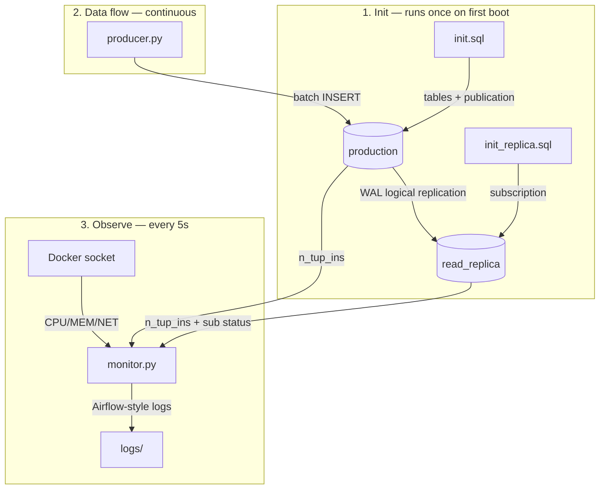

# CDC Pipeline — PostgreSQL Logical Replication Demo

A lightweight Change Data Capture (CDC) pipeline using **PostgreSQL native logical replication** — no Kafka, no Debezium, no extra tools. One producer pushes synthetic user activity logs into a **production** database, and a **read replica** receives every row in near real-time via the WAL stream.

## How it works



### 1. Init — database first boot

`init.sql` (production) creates `user_log_mobile` and `user_log_desktop` tables, then publishes both via `CREATE PUBLICATION cdc_pub FOR TABLE :tables;` — the table list is a single config variable.

`init_replica.sql` (replica) runs `CREATE SUBSCRIPTION cdc_sub ... PUBLICATION cdc_pub;` — the subscription's initial snapshot copies schema + existing rows (full-load first), then CDC streaming begins.

### 2. Data flow — producer → production → replica

`producer.py` generates random user activity rows (uid, activity, device, screen) and batch-inserts them into production. Speed is set in `producer_app/config.json`:

```json
{"BATCH": 500, "FREQ": 2}    → ~1,000 rows/s
{"BATCH": 5000, "FREQ": 2}   → ~10,000 rows/s
```

Every INSERT writes a WAL record. PostgreSQL's logical decoding streams changes from `cdc_pub` (production) to `cdc_sub` (replica) in near real-time — no Kafka, no Debezium, just Postgres.

### 3. Monitor — observe everything

`monitor.py` queries both databases and the Docker socket every 5 seconds, writing Airflow-style logs to `monitoring_app/logs/`:

| Source | Captures |
|---|---|
| `pg_stat_user_tables` (production) | Insert totals per table (live counter) |
| `pg_stat_user_tables` (replica) | Inserts received — diff from production = replication lag |
| `pg_stat_subscription` (replica) | CDC slot active? Last message time? |
| Docker stats API | CPU%, memory, network I/O rates per container |

## Project structure

```
CDC/
├── docker-compose.yml          # 4 services: production, read_replica, producer, monitor
├── init.sql                    # Creates tables + publication (runs on production first boot)
├── init_replica.sql            # Creates subscription (runs on replica first boot)
├── producer_app/
│   ├── Dockerfile
│   ├── producer.py             # Generates & inserts synthetic user_log rows
│   ├── config.json             # BATCH size & FREQ (rows/s target)
│   └── requirements.txt
├── monitoring_app/
│   ├── Dockerfile
│   ├── monitor.py              # Live dashboard + log writer
│   ├── config.json             # DB hosts, refresh & log rotate intervals
│   ├── requirements.txt
│   └── logs/                   # Mounted — log files appear here on host
├── config/                     # Custom postgresql.conf + pg_hba.conf per DB
└── data/                       # Mounted PGDATA — base/, pg_log/ visible on host
```

## Quick start

```bash
docker compose up -d --build
docker compose logs -f monitor   # watch the live dashboard
```

## Monitoring deep-dive

The monitor writes Airflow-style logs to `monitoring_app/logs/` every 5 seconds. Each entry covers three layers:

```
user_log_desktop    prod=  13,130,183  repl=  13,135,245  lag=-5,062  ins/s=  24,007
user_log_mobile     prod=  13,127,317  repl=  13,132,255  lag=-4,938  ins/s=  23,993
  docker/production       CPU=1.4%  MEM=195MB/2.5%  NET rx=1.9MB/s tx=9.3MB/s  (total rx=998MB tx=4.7GB)
  docker/read_replica     CPU=0.8%  MEM=180MB/2.3%  NET rx=9.3MB/s tx=268kB/s  (total rx=4.1GB tx=120MB)
Subscription | active=YES | last_msg=2026-06-16 08:57:17.491743+00:00
```

| Line | What it tells you |
|---|---|
| Table rows | `prod` = live insert counter on production. `repl` = inserts received by replica. `lag` = diff (≤0 = caught up). `ins/s` = current throughput. |
| Docker stats | CPU%, memory, and NET rates (live) + cumulative totals. `tx` spike = CDC stream is active. |
| Subscription | `active=YES` + recent `last_msg` = WAL is flowing, replication is healthy. |

## Resource comparison: 500 vs 10,000 rows/sec

| Metric | 500 rows/s | 10,000 rows/s | Δ |
|---|---|---|---|
| Producer CPU | 0.2% | 1.2% | 6× |
| Production CPU | 0.4% | 1.4% | 3.5× |
| Replica CPU | 0.2% | 0.8% | 4× |
| WAL network (tx) | 464 kB/s | 9.3 MB/s | 20× |
| Replication lag | ~ -250 | ~ -5,000 | — |

The WAL network stream scales linearly with insert volume. Negligible CPU impact even at 10k rows/s — the bottleneck is network bandwidth between containers, not compute.
